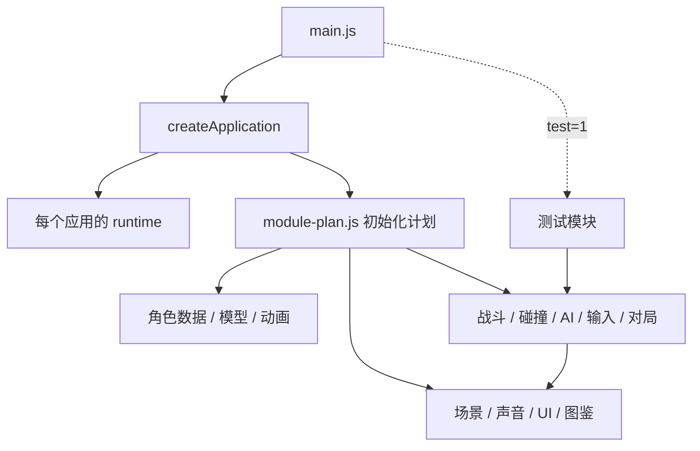

# 架构设计

## 目标与范围

将原来的内嵌脚本、内嵌 Three.js、图片和 CSS 从 HTML 中移出，使角色、战斗、AI、输入、呈现和验收各有明确维护位置。此次迁移保留原有十四角色、120 Hz 战斗、招式判定、四种模式、三张舞台和原验收断言。

源码采用原生 ES modules 和 JavaScript。游戏主要使用 Three.js 程序化场景，当前没有引入 UI 框架的需求。Vite 负责开发、模块打包、资源地址和生产构建，ESLint 与 Prettier 提供代码检查和统一格式，Playwright 在真实浏览器中执行 WebGL 回归。

## 应用组合

入口只负责创建并启动应用。`createApplication({ plan, testModules })` 返回 `start()`，启动后禁止重复启动，初始化失败会报告具体模块及原始错误。当前每个页面启动一个游戏实例；运行上下文隔离并不代表可以在同一个页面并排启动多个游戏，DOM 元素 ID 和浏览器事件仍属于单页面。

每个业务模块导出 `register({ 所需命名空间 })`，返回 `initialize()`。模块只接收其代码使用的命名空间，没有挂载到 `window`，也没有通过 `eval`、拼接源码或全局脚本共享作用域。

启动分为两个同步阶段：

1. 注册所有函数，使后续模块的函数引用在初始化前可用。
2. 按计划初始化数据、资源、规则扩展和事件，最后调用 `boot()`。

注册阶段不创建 WebGL、DOM 或音频资源。初始化阶段负责这些副作用。任何新模块都必须在计划中显式出现，禁止依赖模块导入本身的副作用。

## 运行上下文与接口

`runtime.js` 为每个应用创建 `render / audio / animation / characters / combat / world / input / match / ui / ai / training / art / app / testing` 命名空间。跨模块共享的函数及可变状态属于明确的命名空间；只在单个模块使用的缓存、临时值和旧实现引用保留在模块闭包内。

例如：

- `match.game / player / enemy`：对局状态及战斗双方。
- `combat.Fighter / advanceCombat / collectCombatHits`：战斗实体、固定步长推进与命中收集。
- `world.currentMap / MAPS`：当前舞台及地图定义。
- `input.keys / readPlayerInput / readPlayer2Input`：输入状态与玩家意图。
- `render.scene / renderer / camera`：Three.js 资源及呈现。
- `characters.CHARACTERS`：实际角色定义，包含模型构造器和招式参数。

完整模块提供与使用的成员清单见 `module-contracts.json`，由 `scripts/module-contracts.js` 解析实际源码生成。`provides` 记录直接赋值的命名空间成员，`requires` 记录读取的成员；它描述源码引用，不推断调用顺序或深层对象修改。接口变更后执行 `npm run architecture:update` 并检查差异，`architecture:check` 会阻止源码与文档不一致，单元测试另行检查初始化计划的模块集合。

这里采用的是对现有游戏的渐进工程化：战斗、骨架判定与呈现仍共享 Three.js 向量和模型信息，界面也仍通过固定 DOM ID 工作。命名空间属于内部协作接口，并非已经完成可独立替换的渲染后端或完全无 DOM 的战斗引擎。后续新增代码应优先接收具体依赖，避免扩大共享上下文。

## 系统职责

| 目录                        | 职责                                   | 主要约束                               |
| --------------------------- | -------------------------------------- | -------------------------------------- |
| `characters`                | 角色、招式、模型和骨架                 | 数值与图鉴帧数据从角色定义产生         |
| `combat`                    | 动作状态、碰撞、气、飞行、特殊实体     | 规则走固定模拟步长                     |
| `animation`                 | 姿态、关键帧、接触与收招               | 保持渲染姿态和真实骨架判定一致         |
| `ai`                        | 观察延迟、记忆和角色策略               | 使用已经发生的观察，保持确定性随机种子 |
| `world`                     | 地图、环境、破坏与仙豆                 | 回合切换清理舞台资源与实体             |
| `input`                     | 键盘、触屏和双人操作                   | 分开按住状态与动作边沿                 |
| `render / audio / ui / art` | 场景、镜头、声音、菜单、HUD 和美术资源 | 不引入第二套战斗时钟                   |
| `match`                     | 对局状态、暂停、回合和生命周期         | 对战与返回路径都执行原清理规则         |
| `training`                  | 陪练、命中确认和专项训练               | 评分读取已提交的战斗事件               |
| `testing`                   | 原验收、矩阵和调试接口                 | 正常启动按需隔离，只在 `?test=1` 注册  |

## 原有规则扩展

原代码通过保存旧实现、覆盖函数和扩展 `Fighter.prototype` 来叠加 V1、V2 与美术更新。迁移将这些扩展放在对应职责模块中，并保留其执行顺序，避免直接扁平合并造成帧数据、碰撞和角色行为改变。

因此 `v2-fighter / v2-integration / v2-original-rules` 等文件是现有规则兼容层。它们不是新增玩法的推荐模板。新的规则应在归属模块中形成明确函数，修改最终行为前先用完整矩阵建立回归证据。以后合并旧实现时按角色或机制逐项处理，不在没有验收证据时删掉扩展层。

## 样式、资源与发布

`index.html` 只维护页面结构，样式集中到 `src/styles/`，主背景图在 `src/assets/`。CSS 按旧级联顺序加载，保留现有布局与透明战斗 HUD；运行时注入的 V2 样式也已移到独立样式表。

默认构建生成静态网站及独立资源，测试脚本保留为可选分包。离线导出从同一源码重新构建并将资源内嵌到生成物 `dist/offline/`，保留双击离线游玩的用途。单文件只作为可选交付格式，不作为维护源码。

旧版静态数据导出和历史报告已移除，历史内容保留在 Git 基线 `f3a1a69`。当前验收与清理结果保存在 `docs/`；`dist / test-results / playwright-report / node_modules` 均不进入版本控制。

## 验证与扩展流程

- 修改角色：定位 `characters` 中的定义及相应模型/动画，运行角色专项和完整对战矩阵。
- 修改碰撞、气或特殊实体：运行原有断言、系统专项及完整矩阵。
- 修改页面或样式：运行桌面、移动视口、选角、开战、暂停、返回和招式指南测试。
- 新增模块：导出无副作用的 `register()`，声明具体依赖，在初始化计划和接口清单中同步加入。
- 修改依赖：保持锁文件可复现；Three.js 升级应作为独立变更并重新验证美术和碰撞。

持续集成通过 `npm ci` 安装，运行 lint、格式检查、模块接口一致性检查、单元测试、生产构建及完整浏览器回归。浏览器测试调用实际游戏验收接口，不重新实现一套战斗模型。

工具参考：[Vite 工程入口与构建](https://vite.dev/guide/)、[Playwright 本地服务配置](https://playwright.dev/docs/test-webserver)、[Rolldown 离线单包配置](https://rolldown.rs/reference/OutputOptions.codeSplitting)。
