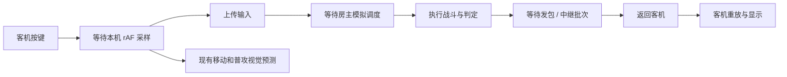

# 联机对战流畅性与实时性深度研究

日期：2026-10-10。对象：当前工作区 `cc9b29b` 基线及尚未提交的战斗、规则版本与诊断改动。本文依据实际源码、隔离的 Chrome 双端 + workerd 实验、一手技术资料。研究期间没有修改正式游戏实现、提交或部署；实验的运行时替换只存在于测试页面。详细规范与平台依据见 [一手资料调研](online-netcode-primary-sources.md)。

## 结论与路线

**近期最大的确定收益，是去掉房主多等一帧的发包顺序、减少中继批等待、修好切换传输时的连续性。若目标是尽可能接近单机的完整格斗手感，最终应走双方确定性回滚同步。** 继续扩展目前的视觉预测可以改善观感，但不能把格挡、闪避、碰撞和命中判定都变成即时的本地操作。

这比把目标定成“提高同步频率”更准确：需要同时降低本机响应、权威确认和弱网长尾停顿，且避免用频繁纠正换取表面上的即时响应。网络传播时间不能被程序消除；回滚让玩家在输入尚未到齐时先玩，再在必要时修正结果。[GGPO 官方](https://www.ggpo.net/)

推荐顺序：**可测量的现有协议优化 → 直连/TURN 路径优化 → 完整存档与确定性原型 → 两端回滚 → 全角色弱网验收**。为了“最大限度”提升，回滚应作为明确的后续技术目标；是否全面切换，以原型性能和正确性决定。

## 1. 延迟究竟花在哪里



按键到确认的大致组成：

```text
输入采样等待 + 上行传输 + 房主调度/模拟
+ 发包等待 + 下行传输 + 客机接收/重放 + 下一次显示
```

“ping”“收到回执”“看见角色移动”“命中最终成立”不能混为同一个数字。应保留四类指标：

- 输入事件到发包、本地预测画面提交：客机是否一按就有反馈。
- 输入发出到房主消费并回执：保留房主处理耗时，找可消除的等待。
- 本地输入到确认的命中/格挡事件：包括招式自身前摇，但必须另列前摇，不能把设计帧数当网络延迟。
- 渲染帧间隔、卡顿、预测纠正和退局：平均 RTT 低也可能经常卡。

现有 `presentation.snapshot()` 使用 `(回执到达 - 客机发送 - 房主处理)/2` 估计单向网络时间。它是近似估计，不能拿来代表完整操作延迟，也不能假定上下行对称。测试时把两个页面各自的 `performance.now()` 直接相减会引入时间原点错误。

## 2. 当前源码里确定存在的瓶颈

| 环节         | 当前实现                                                      | 影响与优先级                                                   |
| ------------ | ------------------------------------------------------------- | -------------------------------------------------------------- |
| 房主发包顺序 | `fixed-step.js` 先调用 `online.frame()`，后 `advanceCombat()` | 本帧模拟数据下一次 rAF 才发，60 FPS 约多等 16.7ms；优先消除    |
| 输入采样     | 键盘事件记录状态，`online.frame()` 读取后发送                 | “立即发送”指不再等旧批次，仍需等一次浏览器帧；考虑事件触发调度 |
| 中继批次     | `session.js` 的 interval 为 100ms                             | 与相位有关的批等待；rAF 量化可让实际发送间隔超过100ms          |
| 中继限额     | `workers/index.js` 每连接固定窗口超过40条/s就关闭             | 直接改60Hz必然不兼容；观战每秒约10条也占同一房主连接额度       |
| 传输协议     | 单个可靠有序 DataChannel，增量帧必须严格连续                  | 丢包重传会拖后续帧；不能直接改为可丢包                         |
| 切换路径     | DC未就绪或缓冲达到64KiB即永久切WS，无交接确认                 | 旧DC包尚未到，新WS包先到会触发缺序退局；本轮受控实验已复现     |
| 模拟调度     | 120Hz子步进由 rAF 批量推进                                    | 120Hz不是独立120Hz输入/发包；房主低帧率拖慢两端                |
| 客机预测     | 地面移动、普通攻击姿势；最长250ms                             | 不完整覆盖跳跃、冲刺、格挡、特殊技能与真实碰撞                 |
| 中继位置     | 三个房间共用固定名字的一个DO                                  | 不能假设每局或每位玩家都有就近中继                             |

代码依据：[`fixed-step.js`](../src/combat/fixed-step.js)、[`session.js`](../src/online/session.js)、[`transport.js`](../src/online/transport.js)、[`presentation.js`](../src/online/presentation.js)、[`workers/index.js`](../workers/index.js)、[`Pages网关`](../functions/api/online.js)。

当前数据不是普通“坐标快照”：房主发送每个浏览器帧的 `dt`、每次子步采样的双方输入，客机完整重放这些步骤。`seq` 缺口立即退局，检查点仅比较部分字段。因此 **丢弃旧帧只留最新、直接取消可靠传输、只加大预测到1秒，都不适用现有协议**。

## 3. 本轮双端实验

### 方法与范围

使用独立端口5198/8798，避免使用已有本地测试房间和线上玩家。Chrome真实WebGL，两个960×600页面，同机通信，保留正常渲染，不使用假时钟。每组32次左右移动按下及松开，改变按键间隔避免固定节奏与刷新率锁相，包含热身与收尾约11秒采样。网络处理、战斗模拟、Worker中继和回执均使用项目实际实现。

最终复核使用单独输出到 `performance/online-latency-build/` 的固定生产构建，六组共用同一产物，不启用开发热更新；构建JS/CSS/HTML及Worker源码SHA-256保存到结果目录 `build-sha256.txt`。早先开发入口仅用于探索，最终表格采用固定构建数据。

实验方案通过页面运行时包装实现：

- 本帧末发送：把房主原 `online.frame()` 移到当前循环完成后的微任务中。它会包含本帧渲染CPU时间；正式实现应拆分输入采样/网络维护/模拟后flush，直接在模拟后、渲染前发送。
- 中继约33ms：仅在实验中提前满足原flush条件；仍由rAF调度，因此不是精密定时30Hz，也没有修改服务端限额。
- 双向75ms：在房主接收input和客机接收frames的应用回调分别增加75ms，保留原始传输。它检验150ms额外往返等待下的应用行为，**不模拟真实链路丢包、SCTP重传、拥塞或跨运营商路由**。
- 回执统计仅保留采样开始后发送的输入时间戳，同一回执去重；包括移动时视角变化产生的输入。被更新输入覆盖且没有单独回执的输入不成为独立样本，因此它不是每次按键的完整追踪系统，后续正式诊断要加inputId与消费tick。
- “首次画面响应”测角色root变换，不测屏幕发光。反复移动时可能受未完成的预测校正影响，只用于观察，不能单独证明端到端输入延迟。

### 最终采样结果

Chrome 155.0.8059.40，macOS Metal，帧间隔中位数约16.7ms。下表是**输入包发出到首次收到该输入时间戳的回执**，不是按键到屏幕发光，也不是纯网络RTT。表中的加速都是实验方案。

| 连接与方案                   | 独立回执样本数 | 确认P50 | 确认P95 | 最新模拟帧发送前停留P50 |
| ---------------------------- | -------------: | ------: | ------: | ----------------------: |
| 当前直连                     |            263 |  27.6ms |  36.9ms |                  16.4ms |
| 直连，本帧末发送             |            263 |  13.2ms |  23.7ms |                   2.2ms |
| 当前中继，100ms批次          |             72 |  54.1ms | 131.1ms |                  16.6ms |
| 中继，约33ms批次＋本帧末发送 |            103 |  32.7ms |  49.8ms |                   1.9ms |
| 当前中继，双向各加75ms       |             73 | 196.7ms | 262.8ms |                  16.6ms |
| 加速中继，双向各加75ms       |            103 | 189.0ms | 249.3ms |                   2.0ms |

固定构建短测中，直连确认P95下降13.2ms，中继下降81.3ms，加入双向延迟后中继下降13.5ms。六组结束时双方仍在对局，未捕获页面脚本错误；不代表全部招式和弱网情况通过。

**延迟注入场景的长尾没有被证明解决。** 加速组最大确认耗时383.7ms，高于基线273.9ms；该最大样本中房主处理15.3ms，剩余约368.4ms包含应用注入等待和其他收发/调度耗时，远高于设定的150ms额外等待。当前探针没有分别记录每个注入定时器实际等待时长，不能进一步归因，也不能据此宣称公网长尾变好。下一步应补实际注入时长和逐段时间戳，并用网络层整形、重复试验验证。探索性开发入口测得的更大改善不替代此处固定构建结果。

64次按键边沿的输入事件到发包P95各组约13.2–14.0ms，印证当前仍受rAF采样限制。角色root首次变化P95约26.7–31.0ms；高延迟组有持续预测/纠正，不适合单独用于判断真实输入到显示延迟。

当前中继每批中位数6个浏览器模拟帧，加速后约2个；实际发包频率仍受rAF和间隔阈值影响。单包JSON字符数中位数：直连约394–395，中继当前约855–882，加速后约488–498；不含外层协议、加密、IP/SCTP/TCP开销，也不是云账单字节数。

### 如何解释结果

最新帧发包前停留时间不等于中继里最老帧的年龄：一个100ms批次中最新帧只等一帧，最早的帧可能已经等了接近整个批次。回执确认耗时更能反映操作等待。

实验是方向验证，不是公网基准，也不是30分钟激战稳定性验收。各组单次短跑与浏览器帧相位不同，不能给差值附上统计显著性或长期服务保证。加速方案在本轮没有观众；改中继频率必须另测观战与输入突发的限频预算。

### 切路缺序退局已受控复现

在真实直连对局中，实验扣留房主DC的第58批，并把该通道的可见缓冲量设为64KiB，触发原有 `packet()` 自动改走真实本地WebSocket中继。客机已确认到57，却先收到59，实际产生“对战数据顺序不一致”，随后退出对局。

这验证了当前传输交接在旧路径存在未到数据时的协议缺陷。积压和扣留由测试人为构造，不是观察到的公网自然丢包，也没有据此估计发生概率。探针结果保存在 `performance/online-latency-research/switch-probe.json`。

## 4. 第一阶段：保留当前规则，消除人为等待

### 4.1 调整主循环阶段

建议清晰拆成：处理网络消息/采样输入 → 执行固定tick → 发送本次新增模拟记录 → 更新预测与画面 → 渲染。不要将整个 `online.frame()` 简单在循环中调用两遍，否则可能重复消费动作、记录预测或发送观战帧。

输入事件应只写入一个有序队列，由统一采样器生成inputId、held状态、actionId和目标tick。键盘/触控边沿可触发低延迟flush，持续移动/方向更新限频；必须处理一次事件被rAF再读取、keydown repeat、松键、blur、触控取消。读取输入的现有函数会消费动作边沿，不能在多个地方随意调用。

收益上限：发送顺序优化通常省一帧；事件发送可减少0到一个rAF周期的采样等待。两者不是减少公网传播时延。120Hz屏幕上的这部分预算约8.3ms，30Hz设备上约33.3ms。

### 4.2 缩短中继周期，统一计算消息预算

以30Hz权威数据为初始候选，比较20/30/60Hz的P95确认时间、开销和弱网表现。30Hz平均批等待在理想均匀相位下约16.7ms；当前100ms周期约50ms，理论平均差约33.3ms。该推导不包含rAF量化、处理及网络时间。

先改服务端策略：控制消息、战斗输入/状态和观战按类型计量，限制总消息/字节/CPU，使用允许短突发的token bucket。服务端依据角色与对局状态验证权限，不能仅把40改成无穷大。按键动作优先，持续held合并到最新状态，观战保持独立预算。

举例：30次战斗帧 + 10次观战帧已经把当前40条固定窗口用满，没有信令、控制与边界抖动余量。60Hz更不能直接上线。按实际入站消息计算费用；Cloudflare的WebSocket计费折算不等于处理负载折算。[DO定价](https://developers.cloudflare.com/durable-objects/platform/pricing/)

### 4.3 必须补传输交接和恢复

为对局加入epoch、连续frame/tick序号、接收确认和有限发送历史。切路时宣布新的transportEpoch和已确认位置；接收方去重、有限重排，补齐缺口后继续。旧通道的迟到包只能补缺口，不能把新held状态倒退；动作有独立ID，不能二次执行。

当前没有完整可恢复战斗快照时，缺口只能重发历史帧，不能跳过。超出历史上限时明确结束/重连；待完整存档能力实现后，才可从完整状态恢复。仅增加等待几十毫秒的重排缓冲不够：旧路径永久断开时仍需补发。

发送成功必须先于移除可靠待发记录。目前发送处先 `splice(0)`、增加序号，再调用 `packet()`；失败返回或抛错缺乏对应的恢复过程。收发队列同时记录字节数、最老数据年龄、缺口持续时间；64KiB只是大小阈值，不能代表可接受延迟。

### 4.4 预测与渲染的短期改善

现有统一 `lerp(1-exp(-60dt))` 会平滑本地预测和权威纠正；它的时间常数约16.7ms，不能当作固定附加延迟。可试验“本地可确定移动直接呈现、纠正偏移单独平滑”，比较输入响应、拉回幅度和相机抖动。

远端动作可采用小幅自适应插值/有限外推；插值换取平滑会增加显示延迟，应按抖动调节，不能给本地人物统一套100ms插值。短期扩展跳跃/冲刺预显示必须尊重受击、资源、碰撞与无敌边界。长期避免维护第二份完整但不参与判定的格斗逻辑，直接进入完整预测/回滚更有价值。

## 5. 第二阶段：降低真实网络路径时延

优先保留质量合格的P2P；直连不通时增加TURN/UDP候选，TCP/TLS与WebSocket作为可达性后备。质量按当前候选对RTT、应用确认分位数、抖动和积压判断，不能用“连上了”或者“传输名称是WebRTC”代替实际质量。

TURN是转发，不是魔法加速；可能改善NAT可达性，也可能因绕路更慢。同一个DataChannel在TURN/TCP或TLS路径上仍可能受到底层TCP重传等待影响。Cloudflare TURN对于大陆用户采用境外节点，若朋友主要在大陆，要测实际运营商与地域，并比较目标地区中继，不能默认全球Anycast就是本地线路。[Cloudflare TURN FAQ](https://developers.cloudflare.com/realtime/turn/faq/)

DO中继建议大厅与对战分开：大厅只负责发现和匹配，对战按房间或地区创建对象，选择兼顾双方的路径。当前单DO的位置未在本轮核实；locationHint为尽力放置，不能把给已有对象增加hint理解为搬迁。直连成功后，移动DO不改变P2P战斗路径。[DO位置文档](https://developers.cloudflare.com/durable-objects/reference/data-location/)

可在开战前评估双方设备模拟P95与网络状态，协商由更稳定的前台设备担任当前权威端，并将网络host与画面座位拆开。它能减轻“弱设备当房主”的影响，但仍不消除角色间的裁决时序差异。

## 6. 第三阶段：用回滚突破房主回传等待

### 6.1 为什么不是继续叠加视觉预测

当前客机做出闪避后，房主可能已经依据尚未收到闪避的状态判定命中；显示层不能改变这次判定。增大移动外推时间或隐藏受击只会造成更明显的纠正。双方回滚则把输入绑定到对应模拟tick，收到迟到输入后从该tick之前恢复并重算，双方采用一致的输入时序规则。

它仍有取舍：预测错的动作/命中会撤销，极高抖动会超出窗口，两端需要帧速同步。网络物理延迟越高，远端新动作越不可能提前知道。回滚提供低本地等待，不保证所有跨端画面在每个瞬间相同，也不提供防作弊。

朋友间1v1优先研究双端确定性回滚。若未来需要排名、防作弊和独立裁判，再评估专用权威服务器；服务器能够改善裁决信任，却不自动使传播路径更短。仅做“客机完整预测＋房主校正”也有收益，但若房主不按迟到输入重算交互，房主判定优势仍保留。

### 6.2 现有代码可复用与必须补齐的部分

可复用：120Hz固定子步进、紧凑输入、随机种子、联机版本检查、现有两端重放和战斗验收。

必须新增：

- `CombatState` 完整纯数据状态；`save/load/hash/step(tick, inputs)` 接口。
- 角色坐标/速度/朝向、攻击阶段、连招和取消窗口、输入缓冲、受击/硬直/无敌、资源/冷却、控制反转、形态、双方引用关系。
- 投射物/飞刃/召唤物、地图破坏与可碰撞状态、仙豆、随机状态、实体ID计数器、终局与计时、hitStop、子步累积余量。
- 逻辑状态与Three.js对象、DOM、音效、镜头的分离；骨架判定依赖仍需保留相同确定性计算，不能随意换成简单碰撞盒。
- 稳定事件ID与效果去重。重算10个tick不能播放10遍音效或重复修改战绩；胜负与不可逆结算等确认后提交。

特别要定义**网络tick和战斗时间的关系**：当前 `game.simTime` 在开场和hitStop期间不会像墙钟一样持续推进，而hitStop期间仍会捕获输入。新协议不能直接拿 `simTime / STEP` 作为唯一网络帧号；应使用持续推进的固定调度tick，显式存储冻结状态和战斗计时，明确冻结期间动作边沿在哪个tick被记录、在哪个tick生效。否则只做正常走路的回滚原型通过，真正连续命中时仍可能错帧。

现有checkpoint只有种子、时间及双方部分资源/位置/状态计时。它既不是完整hash，也不能恢复状态。观战快照为显示服务，同样不能直接充当rollback存档。已有跨端增量重放通过，是起点，不是全部确定性证明。[GGPO回调接口](https://github.com/pond3r/ggpo/blob/master/src/include/ggponet.h)

### 6.3 预测窗口、输入延迟和120Hz

120Hz每tick约8.33ms。近似对称、相位对齐、立即发送时，150ms RTT意味着远端输入单程约75ms，约9tick迟到；不是必然18tick。抖动、补包、发送节奏与模拟相位差需要另加余量。

可从0–2tick本地输入延迟进行实验，以实际到达的输入tick落后量选择回滚窗口。2tick会固定增加约16.7ms本地等待；扩大回滚窗口不固定增加输入等待，但增加最差重算和错误预测幅度。窗口耗尽要适度等待或恢复，不无限外推。完整推导见 [120Hz窗口分析](online-netcode-primary-sources.md#120-hz-下怎样估算窗口)。

状态环形缓冲的内存约为单份状态大小×保留tick数；帧CPU预算要包括正常模拟、存档/hash、最差回滚重算、接收处理和绘制。60FPS总帧预算约16.7ms，120FPS约8.3ms。在120Hz模拟下，建议原型实测8/12/18/24tick重算与密集技能场景，而不是预设所有手机均能承受250ms回滚。

### 6.4 新传输协议再考虑不可靠实时数据

回滚协议可采用 `matchEpoch + inputTick + ackTick + 最近N个tick输入`，每个动作绑定tick/ID，以冗余补丢包、去重及确认维护完整输入史；持续held按周期完整发送，防止释放丢失造成粘键。预测远端held可以沿用上次状态，一次性动作不能每tick重复预测。

实时输入可评估unordered与有限可靠性；开始/规则/状态恢复保留可靠控制。不同通道仍共享SCTP拥塞，不能靠拆通道隔离所有卡顿。不要让大快照、观战和资源下载挤满同一发送预算。[W3C DataChannel](https://www.w3.org/TR/webrtc/#rtcdatachannel)、[RFC8831](https://datatracker.ietf.org/doc/html/rfc8831#section-5)

## 7. 设备性能也是联机延迟

主线程长任务会同时阻塞输入、网络回调、模拟和渲染。当前120Hz只是固定步长，不是独立调度器。先profile正常激战下每tick CPU、收到批次的重放CPU、JSON处理、绘制提交及GC，保护P95/P99，而不是只看FPS均值。

如果完整状态已从视图分离，模拟迁入Worker可降低主线程渲染对调度的干扰；此前直接搬入Worker会遇到Three.js/DOM/音效与姿态判定依赖，跨线程复制也有成本。WASM不是必选项，更不是确定性与低延迟的自动保证。

网页后台rAF常被暂停；移动端也可能暂停整个页面。Worker不能保证操作系统永不挂起。需要明确切后台释放输入、双方等待/结束的策略，不能靠不停setInterval保证后台公平对战。[MDN rAF](https://developer.mozilla.org/en-US/docs/Web/API/Window/requestAnimationFrame)

保留画质与帧率目标：优先减少重复HUD写入、分配、无效效果更新与观战序列化，测出GPU热点后再做合批或可选画质档。不能把自动降低画质得到的帧率提升记为纯联机优化。

## 8. 分阶段交付与验收

| 阶段                | 具体交付                                                                       | 放行条件                                                                        |
| ------------------- | ------------------------------------------------------------------------------ | ------------------------------------------------------------------------------- |
| A：现有协议快速收益 | inputId/tick诊断；模拟后flush；输入统一队列；中继周期与限频预算；切路确认/补发 | 直连、中继、带观众三种模式；无丢动作/重复动作；确认P95对比；切路不误退          |
| B：连接质量         | TURN临时凭据、候选与降级原因、区域路径对照                                     | 两台不同网络设备；同地区/跨地区/热点；证明可达率、P95与费用影响                 |
| C：回滚核心原型     | 单角色对战、无道具舞台、完整状态save/load/hash、输入脚本、效果去重             | 每tick确定性；恢复任意历史tick重放一致；跨Chrome/Firefox/Safari；低性能设备预算 |
| D：全机制回滚       | 14角色、全部形态/投射物/控制/地图破坏、终局和观战                              | 相同输入记录各端hash一致；最坏窗口重算不持续掉帧；错误音效/幽灵命中可控         |
| E：公网验收         | 双端独立日志、真实网络扰动与真人对战                                           | 30分钟对局；P50/P95/P99、输入覆盖率、最大卡顿、修正距离、退局率与公平性         |

测试矩阵至少覆盖：RTT 0/30/80/150/250ms，抖动0/10/30ms，丢包0/1/3/5%及突发连续丢包，上下行不对称，短暂带宽收缩和切网。丢包与拥塞需在隔离网络或代理/系统网络整形层注入；应用回调delay不足以代替。

设备包含60/120Hz与低性能手机；场景包含近身抢招、反应格挡、投技/拆投、闪避、跳跃、必杀、同时命中、反转控制与形态切换。双方交换host，不能只测房主进攻和客机走路。高刷新率应比较同一目标帧率下的额外在线等待，不能改变招式帧数据掩盖延迟。

建议的候选目标（尚未达成承诺）：本机有效输入在下一个可渲染帧出现反馈；现有协议直连不再额外留存整帧；中继批次30Hz且不触发限频；常用网络范围内回滚本地输入固定延迟不超过所选0–2tick；断线/窗口耗尽行为明确。每个目标必须同时检查一致性和纠正质量。

## 9. 不优先投入的方向

- 把120Hz提升到240Hz：不能消除一帧等待和网络往返，先增加CPU成本。
- 仅换WebTransport/QUIC：不能原样替代浏览器P2P，部署与协议均需重做；收益先与已具备的WebRTC比较。
- 先改二进制/压缩所有包：本轮每批仅数百到约千字符量级，先减少等待和拥塞；测到编码/带宽热点再做。
- 给客机所有画面加大缓冲：可能平滑，但直接增加实时延迟。
- 只升级服务器套餐或Three.js：目前发现的是可定位的调度和协议问题，不能用版本或价格代替修复。
- 凭一次同机短测宣称公网“零延迟”：真实网络和实体设备仍需独立验证。

## 10. 复查入口

- [一手资料与架构取舍](online-netcode-primary-sources.md)。
- 本地实验脚本：`performance/online-latency-research.mjs`；结果目录：`performance/online-latency-research/`。按仓库惯例保持忽略，不进Git。
- 切路探针：`performance/online-switch-probe.mjs`，区分人为积压/扣留消息和真实公网丢包。
- 本轮联机相关单元测试：`node --test tests/unit/online*.test.js`，13项通过。
- 未做：真实跨设备/运营商、实体手机、长时间激战、真实丢包整形、TURN开通或回滚实现。本文不将这些项目标为已完成。

本地复查命令（两个服务需分别保持运行）：

```sh
VITE_ONLINE_URL=ws://127.0.0.1:8798/connect npx vite build --outDir performance/online-latency-build
npx vite preview --host 127.0.0.1 --port 5198 --outDir performance/online-latency-build
WRANGLER_LOG_PATH=/tmp/dragon-ball-latency-wrangler.log npx wrangler dev --config workers/wrangler.jsonc --port 8798 --inspector-port 9298 --persist-to /tmp/dragon-ball-latency-research-state
node performance/online-latency-research.mjs
node performance/online-switch-probe.mjs
```
